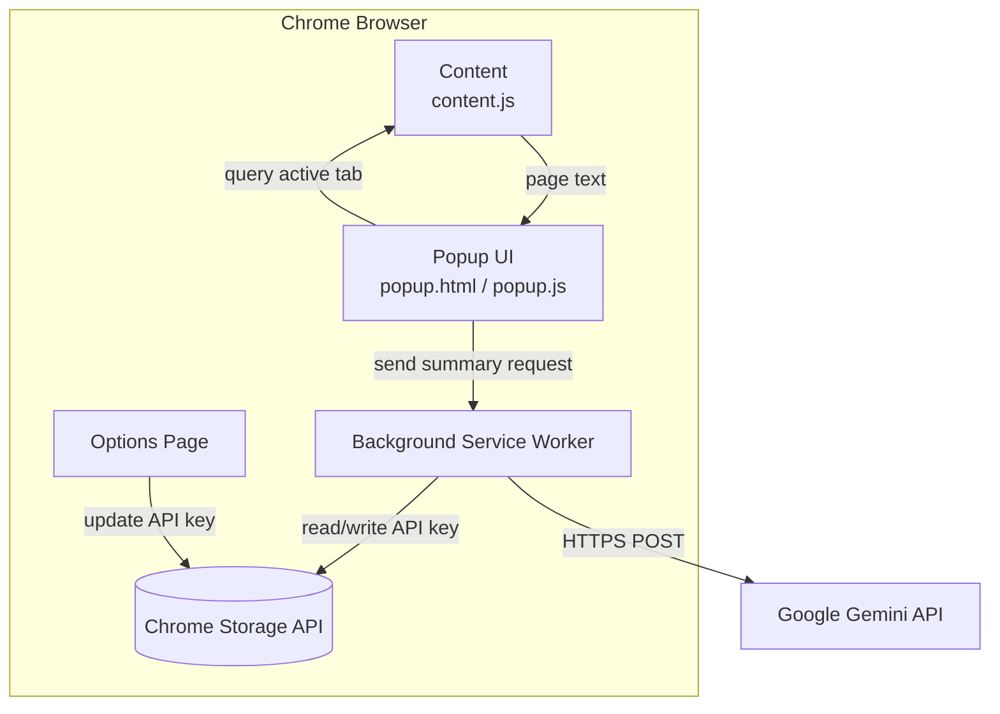

# Minify Extension Architecture

## 📋 Table of Contents

- [Overview](#overview)
- [Architecture Diagram](#architecture-diagram)
- [Component Breakdown](#component-breakdown)
- [Data Flow](#data-flow)
- [Technology Stack](#technology-stack)
- [API Integration](#api-integration)
- [Security Architecture](#security-architecture)
- [Extension Lifecycle](#extension-lifecycle)
- [Error Handling](#error-handling)
- [Performance Considerations](#performance-considerations)

## 🎯 Overview

Minify is a Chrome Extension (Manifest V3) that provides AI-powered web page summarization using Google's Gemini API. The extension follows a modular architecture with clear separation of concerns across different components.

### Key Architectural Principles

- **Separation of Concerns**: Each component has a single, well-defined responsibility
- **Security First**: API keys are securely stored, no data persistence except configuration
- **User Privacy**: No tracking, analytics, or unnecessary data collection
- **Minimal Permissions**: Only requests necessary Chrome APIs
- **Performance**: Lightweight processing with efficient text extraction

## 🏗️ Architecture Diagram




## 🧩 Component Breakdown

### 1. Manifest (manifest.json)

**Purpose**: Extension configuration and permissions declaration

**Key Configurations**:

```json
{
  "manifest_version": 3,
  "permissions": ["scripting", "activeTab", "storage"],
  "host_permissions": ["<all_urls>"]
}
```

**Responsibilities**:

- Declares Chrome Extension API version (V3)
- Specifies required permissions
- Defines extension entry points (popup, options, background)
- Registers content scripts for all URLs

### 2. Background Service Worker (background.js)

**Purpose**: Handles extension lifecycle events

**Key Functions**:

- `chrome.runtime.onInstalled`: Triggered when extension is installed/updated

**Workflow**:

```javascript
Installation → Check for API Key → Open Options Page (if needed)
```

**Characteristics**:

- Runs in the background (event-driven, not persistent)
- No direct user interaction
- Lightweight and efficient

### 3. Content Script (content.js)

**Purpose**: Extracts text content from web pages

**Injection**:

- Automatically injected into all web pages (`<all_urls>`)
- Runs in the context of the web page
- Has access to the page's DOM

**Key Functions**:

```javascript
getArticleText() {
  1. Check for <article> tag (semantic HTML)
  2. Fallback: Collect all <p> tags
  3. Return concatenated text
}
```

**Message Handling**:

```javascript
chrome.runtime.onMessage.addListener((req, sender, sendResponse) => {
  if (req.type === "GET_ARTICLE_TEXT") {
    sendResponse({ text: getArticleText() });
  }
});
```

**Limitations**:

- Cannot access Chrome Extension APIs directly
- Only communicates via message passing
- Isolated from popup/background scripts

### 4. Popup UI (popup.html/js)

**Purpose**: Main user interface for the extension

**Components**:

- **Summary Type Selector**: Dropdown for brief/detailed/bullets
- **Summarize Button**: Triggers the summarization process
- **Copy Button**: Copies summary to clipboard
- **Result Display**: Shows loading state or summary

**State Management**:

```javascript
States:
1. Initial: "Select a mode and summarize..."
2. Loading: Animated spinner + "Generating summary..."
3. Success: Display summary text
4. Error: Display error message
```

**Key Interactions**:

1. User clicks "Summarize"
2. Retrieve API key from storage
3. Query active tab
4. Send message to content script
5. Receive article text
6. Call Gemini API
7. Display result

**Error Handling**:

- API key not found → Prompt user to configure
- Page connection failed → Suggest refresh
- Text extraction failed → Page not compatible
- API error → Display error message

### 5. Options Page (options.html/js)

**Purpose**: API key configuration interface

**Features**:

- Password input field with toggle visibility
- Save button with success feedback
- Auto-close after successful save
- Link to Google AI Studio

**Data Flow**:

```javascript
User Input → Validation → Chrome Storage → Success Message → Close Tab
```

**Storage API Usage**:

```javascript
// Save
chrome.storage.sync.set({ geminiApiKey: apiKey });

// Load
chrome.storage.sync.get(["geminiApiKey"], (result) => {
  // Use result.geminiApiKey
});
```

### 6. Styling (style.css)

**Purpose**: Unified dark theme design system

**CSS Architecture**:

- CSS Custom Properties (variables) for theming
- BEM-like naming conventions
- Mobile-first responsive design
- Consistent spacing and sizing

**Color Scheme**:

```css
--bg: #0d1117      /* Main background */
--panel: #161b22    /* Component background */
--border: #30363d   /* Border color */
--text: #c9d1d9     /* Primary text */
--muted: #8b949e    /* Secondary text */
--accent: #58a6ff   /* Interactive elements */
--success: #3fb950  /* Success states */
```

## 🚀 CI/CD & Automation

Minify uses a modern DevOps approach to handle versioning and distribution. The extension is automatically bundled and released using GitHub Actions.

### 1. Release Workflow (`release.yml`)
The automation layer sits outside the browser environment and manages the project lifecycle.

**Pipeline Trigger:**
- **Event**: `push`
- **Filter**: `tags: ['v*']` (e.g., `v1.0.0`)

**Pipeline Steps:**
- **Environment Setup**: Spins up an `ubuntu-latest` runner.
- **Source Bundling**: Uses `zip` to package the root directory while excluding development-only files (`.github`, `.vscode`, `docs`).
- **GitHub Release**: Uses `softprops/action-gh-release` to create a formal release entry.
- **Asset Attachment**: Uploads the generated `.zip` as a release asset for users to download.

### 2. Permissions & Security
- **Scoped Permissions**: The workflow uses `contents: write` permission to ensure it can create releases without having unnecessary access to other repository settings.
- **Automated Notes**: The action automatically generates release notes based on commit history.

## 🔄 Data Flow

### Primary Flow: Summarization

```
1. User Action
   └─> Click "Summarize" button in popup

2. Storage Retrieval
   └─> chrome.storage.sync.get(["geminiApiKey"])

3. Tab Query
   └─> chrome.tabs.query({ active: true, currentWindow: true })

4. Message Passing
   └─> chrome.tabs.sendMessage(tab.id, { type: "GET_ARTICLE_TEXT" })

5. Content Extraction
   └─> content.js: getArticleText() → return { text }

6. Response Handling
   └─> popup.js: receives article text

7. API Call
   └─> fetch(gemini-api-url, { body: prompt + text })

8. Response Processing
   └─> Extract summary from JSON response

9. Display
   └─> Update popup UI with summary
```

### Secondary Flow: Configuration

```
1. Installation
   └─> background.js: onInstalled event

2. Check Storage
   └─> chrome.storage.sync.get(["geminiApiKey"])

3. Open Options (if needed)
   └─> chrome.tabs.create({ url: "options.html" })

4. User Input
   └─> Enter API key in options page

5. Save
   └─> chrome.storage.sync.set({ geminiApiKey })

6. Confirmation
   └─> Display success message
   └─> Close tab
```

### Tertiary Flow: Automated Release (DevOps)

1. **Developer Action**: Developer updates version in `manifest.json` and pushes a new tag (`git tag v1.x.x && git push origin v1.x.x`).
2. **Action Trigger**: GitHub Actions detects the tag and starts the `Release Extension` workflow.
3. **Bundling**: The runner zips the project files, excluding metadata and documentation.
4. **Deployment**: A new GitHub Release is created with the name "Minify v[tag]", and the ZIP file is attached as a downloadable asset.

## 🛠️ Technology Stack

### Core Technologies

| Component    | Technology       | Version           |
| ------------ | ---------------- | ----------------- |
| **Runtime**  | Chrome Extension | Manifest V3       |
| **Language** | JavaScript       | ES6+              |
| **Markup**   | HTML5            | -                 |
| **Styling**  | CSS3             | Custom Properties |
| **Icons**    | Bootstrap Icons  | Latest (CDN)      |
| **AI Model** | Google Gemini    | gemini-2.5-flash  |
| **CI/CD** | GitHub Actions   | YAML Workflow     |

### Chrome APIs Used

```javascript
chrome.runtime; // Extension lifecycle, messaging
chrome.tabs; // Tab queries and management
chrome.storage; // Persistent storage (sync)
chrome.scripting; // Content script injection (implicit)
```

### External Dependencies

- **Bootstrap Icons**: UI iconography (CDN)
- **Google Gemini API**: AI summarization service

## 🔌 API Integration

### Gemini API Implementation

**Endpoint**:

```
POST https://generativelanguage.googleapis.com/v1beta/models/gemini-2.5-flash:generateContent
```

**Request Structure**:

```javascript
{
  contents: [
    {
      parts: [{ text: prompt }]
    }
  ],
  generationConfig: {
    temperature: 0.2  // Low temperature for consistent summaries
  }
}
```

**Prompt Engineering**:

```javascript
// Brief (2-3 sentences)
prompt = `Provide a brief summary in 2-3 sentences:\n\n${text}`;

// Detailed (comprehensive)
prompt = `Provide a detailed summary covering all main points:\n\n${text}`;

// Bullets (5-7 points)
prompt = `Summarize in 5-7 key points. Format each as "- point":\n\n${text}`;
```

**Response Parsing**:

```javascript
const summary = data?.candidates?.[0]?.content?.parts?.[0]?.text;
```

**Error Handling**:

- HTTP errors: Check `res.ok` status
- Parse API error messages
- Fallback to generic error messages

### Text Truncation

**Rationale**: Avoid exceeding API token limits

**Implementation**:

```javascript
const maxLength = 20000;
const truncatedText =
  text.length > maxLength ? text.substring(0, maxLength) + "..." : text;
```

## 🔒 Security Architecture

### API Key Security

**Storage**:

- Stored in `chrome.storage.sync`
- Encrypted at rest by Chrome
- Syncs across devices (secured by Google account)

**Transmission**:

- Only sent to Google's Gemini API
- Always over HTTPS
- Never logged or exposed

**Access Control**:

- Only accessible within extension context
- Not accessible from web pages
- No cross-origin access

### Content Security Policy (CSP)

**Manifest V3 Default CSP**:

```
script-src 'self'; object-src 'self'
```

**Implications**:

- No inline scripts allowed
- No eval() or Function() constructor
- All scripts must be in separate .js files
- External scripts only from CDN (Bootstrap Icons)

### Permission Model

**Minimal Permissions Strategy**:

- `activeTab`: Only access when user clicks extension
- `storage`: Only for API key storage
- `scripting`: Only for content script injection
- `host_permissions`: Required for content script injection

**Runtime Checks**:

```javascript
if (chrome.runtime.lastError) {
  // Handle permission errors
}
```

## ⏱️ Extension Lifecycle

### Installation Flow

```
1. User installs extension
   ↓
2. chrome.runtime.onInstalled fires
   ↓
3. Check for existing API key
   ↓
4. If not found → Open options.html
   ↓
5. User configures API key
   ↓
6. Extension ready to use
```

### Runtime Flow

```
Extension Idle
   ↓
User clicks extension icon
   ↓
Popup opens (popup.html loads)
   ↓
User selects summary type
   ↓
User clicks "Summarize"
   ↓
popup.js executes
   ↓
Content script activated
   ↓
API call made
   ↓
Summary displayed
   ↓
User closes popup
   ↓
Extension returns to idle state
```

### Service Worker Lifecycle

**Event-Driven Model**:

- Service worker starts on events
- Runs briefly, then terminates
- No persistent background page (unlike Manifest V2)

**Events Handled**:

```javascript
chrome.runtime.onInstalled; // Installation/update
chrome.runtime.onMessage; // Message passing (if needed)
```

## ⚠️ Error Handling

### Error Categories

1. **Connection Errors**

   - Content script not injected
   - Tab not accessible (chrome:// pages)
   - **Handling**: Detect `chrome.runtime.lastError`

2. **Extraction Errors**

   - No article content found
   - Empty page
   - **Handling**: Fallback extraction methods

3. **API Errors**

   - Invalid API key
   - Rate limiting
   - Network failures
   - **Handling**: Parse API error responses

4. **Storage Errors**
   - API key not found
   - Storage quota exceeded
   - **Handling**: Prompt user to configure

### Error Recovery Strategies

```javascript
// Graceful degradation
try {
  const summary = await getGeminiSummary(text, type, apiKey);
  displaySummary(summary);
} catch (error) {
  displayError(error.message);
  // Offer retry or configuration options
}
```

## ⚡ Performance Considerations

### Optimization Strategies

1. **Lazy Loading**

   - Content script only activates on demand
   - Service worker is event-driven

2. **Text Truncation**

   - Limit text to 20,000 characters
   - Reduces API latency and costs

3. **Efficient DOM Traversal**

   - Prioritize `<article>` tag
   - Single DOM query for paragraphs

4. **Minimal UI Reflows**
   - Update result div once
   - CSS animations via classes

### Memory Management

- No persistent state in background
- Content script has minimal footprint
- Popup closes when not in use
- No data caching (privacy-first)

### Network Efficiency

- Single API request per summary
- No unnecessary prefetching
- HTTPS connection reuse

## 🔮 Future Architectural Considerations

### Planned Enhancements

1. **Firefox Support**

   - WebExtension API compatibility
   - Storage API differences

2. **Summary History**

   - Local storage for past summaries
   - IndexedDB for larger datasets

3. **Offline Support**

   - Cache common summaries
   - Service worker caching strategies

4. **Multi-Language**
   - i18n API integration
   - Locale-specific prompts

### Scalability Concerns

- **Rate Limiting**: Client-side request throttling
- **Quota Management**: Track API usage
- **Concurrent Requests**: Queue multiple summaries
- **State Management**: Consider Redux/Zustand for complex state

## 📚 References

- [Chrome Extension Manifest V3](https://developer.chrome.com/docs/extensions/mv3/)
- [Chrome Storage API](https://developer.chrome.com/docs/extensions/reference/storage/)
- [Chrome Messaging API](https://developer.chrome.com/docs/extensions/mv3/messaging/)
- [Google Gemini API](https://ai.google.dev/docs)

---

**Architecture Version**: 1.0

---

_For questions about this architecture, please open a GitHub issue or contact the maintainer._
